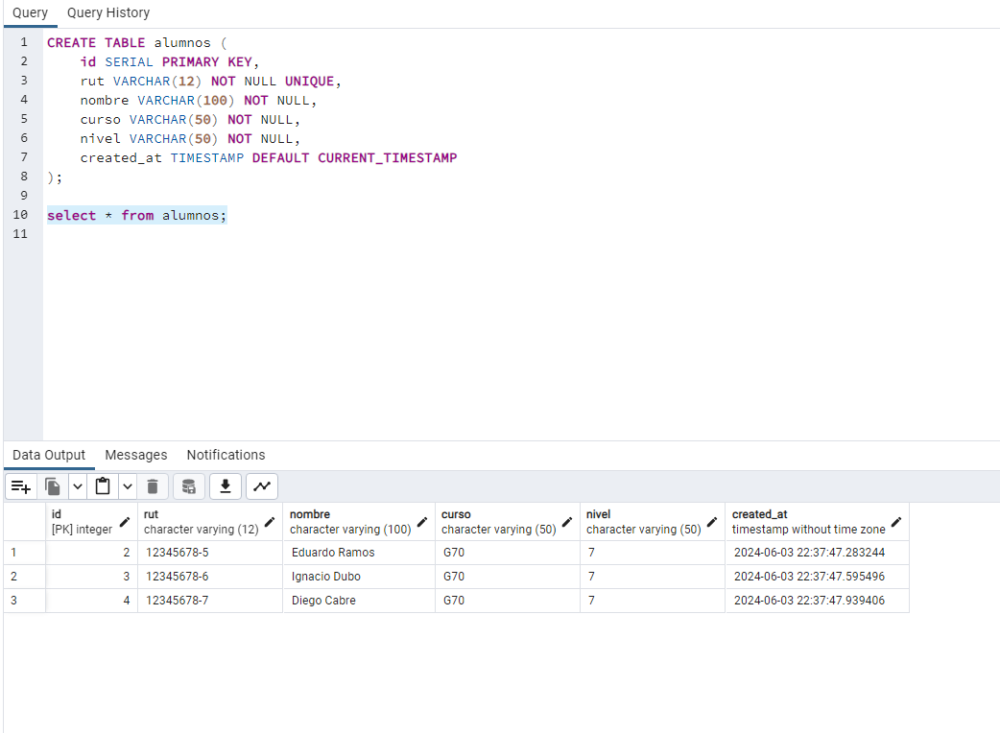

#  Proyecto Academy Always Music2


## En este desafío se pide mejorar la base de datos music. Los requerimientos son:

```
1-Hacer todas las consultas con un Objeto como argumento del método query.
2-Hacer las consultas con texto parametrizado
3-Capturar los posibles errores en todas las consultas e imprimirlos por consola.
4-Obtener el registro de los estudiantes registrados en formato de arreglos.

```

### Pasos a realizar para ejecutar la base de datos:

Instalar npm i pg 

### ***Pasos de registro en la base de datos:***

## 1-Registrar un nuevo estudiante:

``` 
node server.js registrar 12345678-4 "Bianca Salcedo" G70 7
node server.js registrar 12345678-5 "Eduardo Ramos" G70 7
node server.js registrar 12345678-6 "Ignacio Dubo" G70 7
node server.js registrar 12345678-7 "Diego Cabre" G70 7

```
### Traerá como resultado por ejemplo un alumno que sea registrado:

```
***** Academy Always Music *****
Alumno Juan Perez: 12345678-9 fué registrado con éxito!
Alumno Registrado:  { rut: '12345678-9', nombre: 'Juan Perez', curso: 'G70', nivel: 7 }

```

## 2-Obtener el registro de un estudiante:

```
node server.js rut 12345678-4
Traerá  como resultado: 
***** Academy Always Music *****
Alumno consultado:  {
  id: 1,
  rut: '12345678-4',
  nombre: 'Bianca Salcedo',
  curso: 'G70',
  nivel: '7',
  created_at: 2024-06-04T02:37:46.923Z
}

```

## 3-Consultar el registro de todos los estudiantes registrados de la base de datos: en formao de ARREGLOS

```
node server.js consulta
Traerá  como resultado: 
***** Academy Always Music *****
Alumnos registrados: [
  {
    id: 1,
    rut: '12345678-4',
    nombre: 'Bianca Salcedo',
    curso: 'G70',
    nivel: '7',
    created_at: 2024-06-04T02:37:46.923Z
  },
  {
    id: 2,
    rut: '12345678-5',
    nombre: 'Eduardo Ramos',
    curso: 'G70',
    nivel: '7',
    created_at: 2024-06-04T02:37:47.283Z
  },
  {
    id: 3,
    rut: '12345678-6',
    nombre: 'Ignacio Dubo',
    curso: 'G70',
    nivel: '7',
    created_at: 2024-06-04T02:37:47.595Z
  },
  {
    id: 4,
    rut: '12345678-7',
    nombre: 'Diego Cabre',
    curso: 'G70',
    nivel: '7',
    created_at: 2024-06-04T02:37:47.939Z
  }
]

## 4-Actualizar el registro de un estudiante de la base de datos:

```
node server.js actualizar 12345678-4 "Bianca Salcedo" g70 8
Traerá  como resultado: 
***** Academy Always Music *****
Alumno con rut 12345678-4 actualizado con éxito
Alumno Actualizado:  {
  id: 1,
  rut: '12345678-4',
  nombre: 'Bianca Salcedo',
  curso: 'g70',
  nivel: '8',
  created_at: 2024-06-04T02:37:46.923Z
}

```

## 5-Eliminar el registro de un estudiante de la base de datos:

```
node server.js eliminar 12345678-4
Traerá como resultado aqui un ejemplo de como se vería:
***** Academy Always Music *****
Alumno con rut 12345678-4 eliminado con éxito
Alumno Eliminado:  {
  id: 1,
  rut: '12345678-4',
  nombre: 'Bianca Salcedo',
  curso: 'g70',
  nivel: '8',
  created_at: 2024-06-04T02:37:46.923Z
}
```

  

